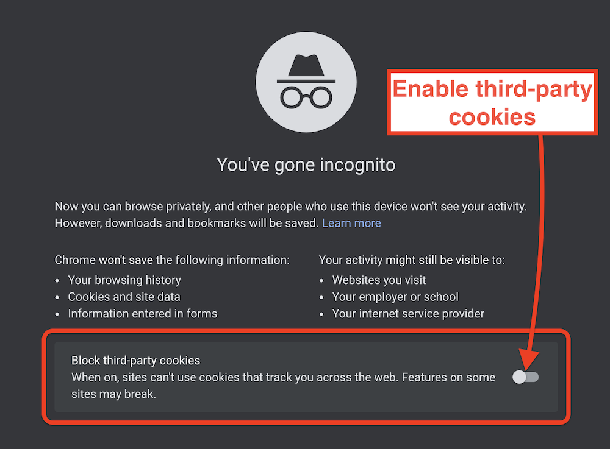

# ImageKit CKEditor 5 Plugin

This plugin integrates ImageKit into CKEditor 5, allowing you to access the embedded Media Library Widget through your CKEditor toolbar. 

With this plugin, you can directly insert images from your ImageKit account into the editor, as well as upload new images to your Media Library.


## Installation

To install this plugin, you should make a custom build of CKEditor 5. Follow the instructions [here](https://ckeditor.com/docs/ckeditor5/latest/builds/guides/development/custom-builds.html), or use the quickstart steps below.

### CKEditor quickstart

Fork the stable branch of CKEditor 5 repository, then clone it locally:

```
git clone -b stable git@github.com:<your-username>/ckeditor5.git
cd ckeditor5
git remote add upstream https://github.com/ckeditor/ckeditor5.git
```

Navigate to the build that will be customized and install dependencies. We will use the classic build:

```
cd packages/ckeditor5-build-classic
npm install
```

Install the ImageKit CKEditor plugin in your custom build folder:

```
npm install --save-dev imagekit-ckeditor5-plugin
```

## Configuration

To load the plugin, configure your editor by editing the `src/ckeditor.js` file. To use the Media Library Widget, import it as follows:

```js
/* ckeditor5-build-classic/src/ckeditor.js */

// ...imported modules
// custom plugin import
import { ImagekitMediaLibraryWidget } from 'imagekit-ckeditor5-plugin';

export default class ClassicEditor extends ClassicEditorBase {}

// Plugins to include in the build.
ClassicEditor.builtinPlugins = [
  // include custom plugin in build
  ImagekitMediaLibraryWidget,
  // ...other components
];

// COnfigure the `imagekitMediaLibraryWidget` plugin to display on the editor toolbar
ClassicEditor.defaultConfig = {
  toolbar: {
    items: [
      'imagekitMediaLibraryWidget',
      // ...other ckeditor plugins
    ]
  },
  // ...other settings
  language: 'en'
};

```

### Build the editor

```bash
npm run build
``` 

Copy the built files into the source of your webpage which will host the editor:

```
cp build/ckeditor* <path_to_your_web_project>
```

## Include the plugin in the frontend

Import the generated build files in your frontend project:

```html
<script src="<path_to_web_project>/ckeditor.js"></script>
```

Provide HTML container elements for widget instance as well as editor instance:

```html
<div class="editor"></div>
<div class="ml-container"></div>
```

Create a JavaScript object with configuration options for the plugin:

```js
var pluginOptions = {
  container: '.ml-container',
  className: 'media-library-widget',
  dimensions: {
    height: '100%',
    width: '100%',
  },
};
```

Create an editor instance that includes the `imagekitMediaLibraryWidget` plugin on the toolbar, with its configuration options.

```js
// ckeditor
var editor;

// initialize ckeditor
ClassicEditor
  .create(document.querySelector('.editor'), {
      imagekitMediaLibraryWidget: {
        config: pluginOptions
      }
    })
  .then(newEditor => {
    editor = newEditor;
    window.editor = newEditor;
  }).catch(error => {
    console.error(error);
  });
```

## Usage

Open a browser and navigate to your app with the CKEditor instance. It should look similar to the image below.
To open ImageKit view, click on the highlighted icon:


If you are not logged in already, do so using your ImageKit username and password.


The Media Library view should open right up, letting you search and select existing images, as well as upload new ones directly.


To insert one or more images into the CKEditor panel, select them and click the "Insert" button in the top right hand area.


The modal dialog will close and selected images will be inserted into the editor automatically!

**Note: Google Chrome (Incognito)**

In order to use this plugin on Google Chrome in Incognito mode, you need to enable third-party cookies:


